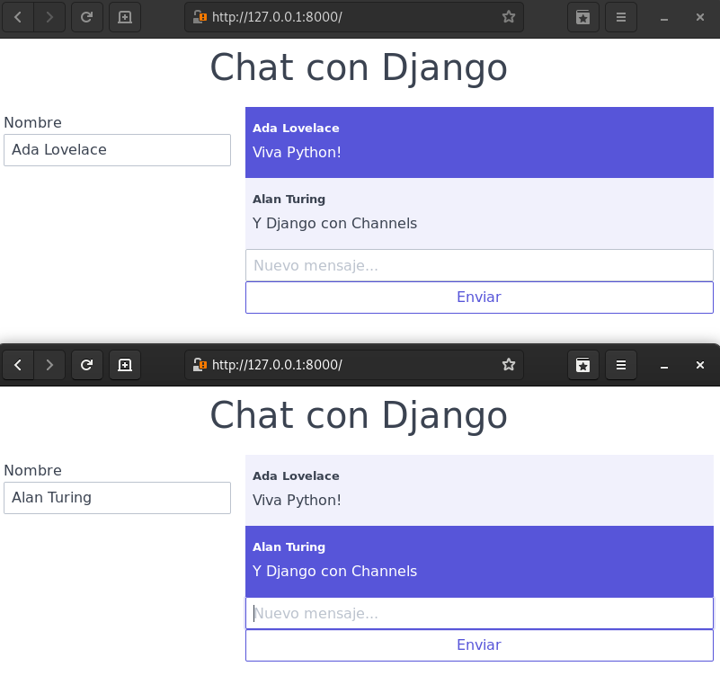

# Ejemplo de Chat con Django

- Asíncrono.
- Channels.
- Integración con Redis.
- Preparado para salas individuales.
- Minimalismo en Front-End con Javascript Vainilla.



## Instalar

``` shell
python3 -m venv venv
source venv/bin/activate
pip3 install -r requirements.txt
```

Y levantar Redis.

``` shell
docker-compose up -d
```

## Ejecutar

``` shell
venv/bin/daphne -b localhost -p 8000 mi_web.asgi:application
```

Abre en tu navegador en ```127.0.0.1:8000```.
